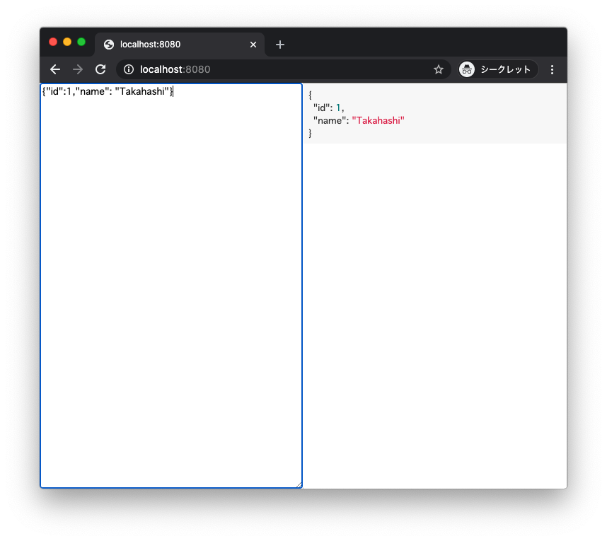

# json-formatter-app

```console
$ make serve
```



## Why

- I know there are lots of similar tools online, but I don't want to paste the data I'm working with.
- I usually use `jq`. But Terminal.app doesn't accept lines that are too long 😡
